<h1 align="center"> 
   UJIAN TENGAH SEMESTER <br>
   SISTERDISTRIBUSI TERDESENTRALISASI
</h1>
<p align="center"><b>Fritria Yosefina Rossa Waroy (215410067)</b></p>

<hr>  

**1. Jelaskan teorema CAP dan BASE dan keterkaitan keduanya.  
2. Jelaskan menggunakan contoh yang pernah anda gunakan.**

<p align="justify">
   <b>CAP:</b> Dalam sistem terdistribusi, kita cuma bisa pilih <b>2 dari 3</b>: konsistensi, ketersediaan, atau tahan gangguan jaringan. Karena sistem harus tahan gangguan, akhirnya kita tinggal pilih mau <code>lebih konsisten (CP)</code> atau <code>lebih tersedia (AP)</code>.
   
   <b>CP:</b> data selalu akurat, tapi kadang permintaan ditolak.
   <b>AP:</b> sistem selalu bisa diakses, tapi data baru rapi belakangan (sesuai prinsip **BASE**).
   
   **GraphQL:** Dipakai sebagai pintu depan satu-satunya untuk klien. Klien tidak perlu tahu banyak service di belakangnya. GraphQL yang ngurus komunikasi antar service, mengumpulkan data, lalu mengembalikan satu jawaban sesuai permintaan klien.  
  
   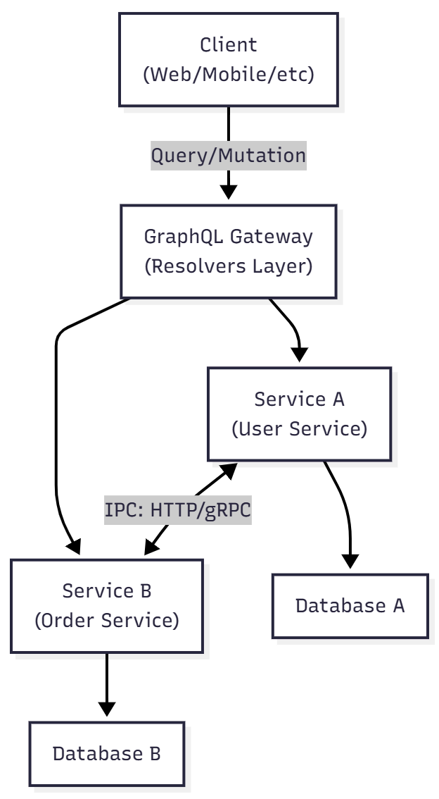
</p><br>

## Streaming Replication di PostgreSQL
*Praktik ini mengikuti modul yang diberikan oleh dosen pengampuh*

> [!Note]  
>  - Pastikan Docker telah terpasang dan daemon-nya sudah aktif,
>  - Docker Compose terpasang.
>  - Jika belum, bisa mengunjungi situs resmi di:
>    - https://docs.docker.com/desktop/ untuk docker desktop
>    - https://docs.docker.com/compose/install/ untuk installasi docker compose 
 
### 1. Struktur Direktori dan FIle  
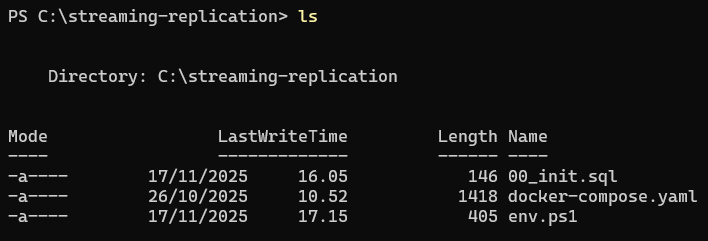

**Terkait masing-masing file:**  

1. **`00_init.sql`**  
   ```sql
   CREATE USER replicator WITH REPLICATION ENCRYPTED PASSWORD 'replicator_password';
   SELECT pg_create_physical_replication_slot('replication_slot');
   ```
   Dipakai untuk menyiapkan PostgreSQL agar bisa melakukan replikasi. Yang mana isinya:
   - Membuat user khusus (replicator) dan
   - Membuat replication slot

3. **`docker-compose.yaml`**:  
   ```yml
   x-postgres-common:
     &postgres-common
     image: postgres:18-alpine
     user: postgres
     restart: always
     healthcheck:
       test: 'pg_isready -U zuser --dbname=zdb'
       interval: 10s
       timeout: 5s
       retries: 5
   
   services:
     postgres_primary:
       <<: *postgres-common
       ports:
         - 5432:5432
       environment:
         POSTGRES_USER: zuser
         POSTGRES_DB: zdb
         POSTGRES_PASSWORD: zpass
         POSTGRES_HOST_AUTH_METHOD: "scram-sha-256\nhost replication replicator 0.0.0.0/0 md5"
         POSTGRES_INITDB_ARGS: "--auth-host=scram-sha-256"
       command: |
         postgres 
         -c wal_level=replica 
         -c hot_standby=on 
         -c max_wal_senders=10 
         -c max_replication_slots=10 
         -c hot_standby_feedback=on
       volumes:
         - ./00_init.sql:/docker-entrypoint-initdb.d/00_init.sql
   
     postgres_replica:
       <<: *postgres-common
       ports:
         - 5433:5432
       environment:
         PGUSER: replicator
         PGPASSWORD: replicator_password
         PGDATA: /var/lib/postgresql/18/docker
       command: |
         bash -c "
         until pg_basebackup --pgdata=/var/lib/postgresql/18/docker -R --slot=replication_slot --host=postgres_primary --port=5432 -X stream; do
           echo 'pg_basebackup failed. Retrying in 5 seconds ...'
           sleep 5
         done
   
         echo 'Backup done, starting replica...'
         chmod 0700 /var/lib/postgresql/18/docker
   
         postgres
         "
       depends_on:
         - postgres_primary
   ```
   File **Docker-compose** ini berisi konfigurasi dua container PostgreSQL: `postgres_primary` sebagai server utama dan `postgres_replica` sebagai server yang mengikuti (replika) server utama. Proses replikasi otomatis berjalan menggunakan pg_basebackup dan replication slot.

4. `env.ps1`
   ```sh
   function dcu { docker-compose up -d }
   function dcd { docker-compose down }
   function dps { docker ps }
   function der { docker exec -it streaming-replication-postgres_replica-1 bash }
   function dep { docker exec -it streaming-replication-postgres_primary-1 bash }
   function dlr { docker logs streaming-replication-postgres_replica-1 }
   function dlp { docker logs streaming-replication-postgres_primary-1 }
   ```
   > ***File ini berisi berbagai definisi `alias` di windows powershell, hanya untuk memudahkan shortcut penulisan perintah, opsional*.**   
   <br>

> [!NOTE]
> _command yang dituliskan di sini memanfaatkan alias yang telah didefinisikan di file env.ps1_
   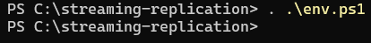

### 2. Menjalankan docker-compose 

<p>
   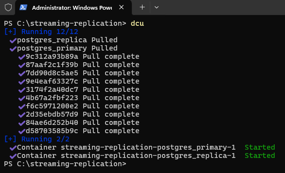<br> 
   Saat menjalankan docker-compose up, semua file yang belum ada di lokal akan otomatis ditarik (pull) dari registry.
</p>
   
<p>
   Periksa apakah kedua container untuk PostgreSQL telah berhasil dijalankan:<br>
   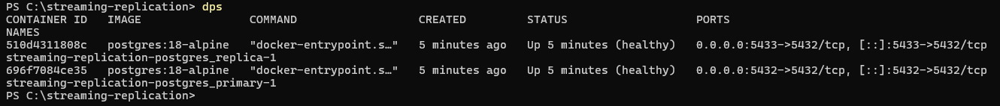
</p>   

<p>
   Periksa bagian <b>STATUS</b>. Jika <code>container</code> berjalan dengan baik, akan tertulis healthy. <br>
   Jika tidak, kita bisa menelusuri penyebabnya melalui <code>log Docker</code>:<br>
   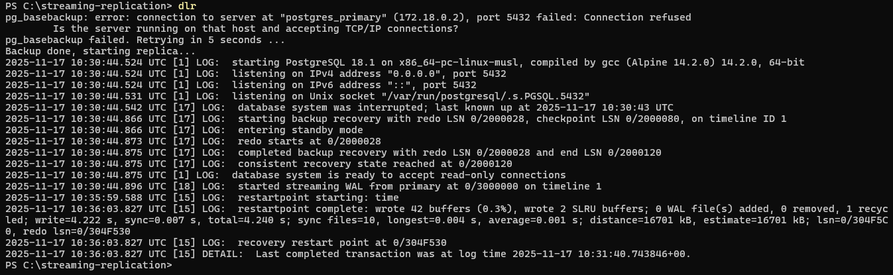
</p>

   **Jika statusnya sudah *healthy*, berarti pada tahap ini kita memiliki dua instance PostgreSQL 18:**  
   1. `streaming-replication-postgres_primary-1`  
   2. `streaming-replication-postgres_replica-1`  
  
### 3. Pengujian  
Untuk memastikan replikasi sudah berjalan, kita dapat memeriksanya melalui tabel diagnostik PostgreSQL 18 atau dengan mencoba melakukan manipulasi data pada tabel.  
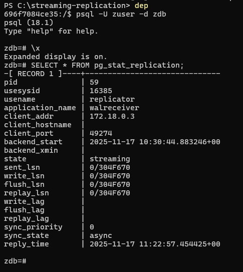 

**Pada server replica kita bisa melihat status**:  
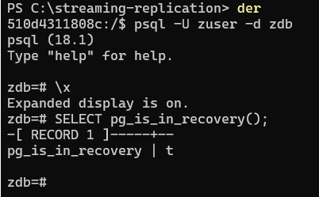   
Hasil `true (t)` menandakan bahwa server tersebut adalah replica/standby, yang tugasnya hanya menyalin data dari primary dan menyediakan akses baca.  

<p>
   Untuk melihat efek replikasi pada kedua server, kita membuat sebuah tabel dan mengisinya di server utama (primary). Setelah itu, kita memeriksa hasilnya di server replica.
</p>
<p>
   <b>Sebelum pembuatan tabel</b><br>
      
   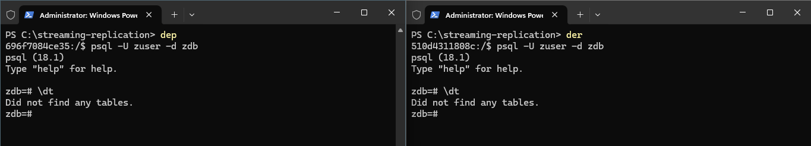  
</p>
<p>
   <b>Manipulasi data pada Primary</b><br>
   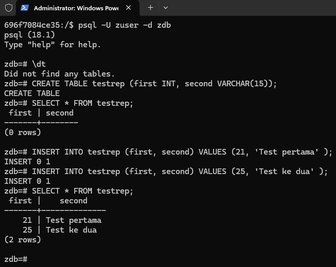  
</p>
<p>
   <b>Secara otomatis, perubahan data tersebut akan direplikasi ke server replica.</b>
   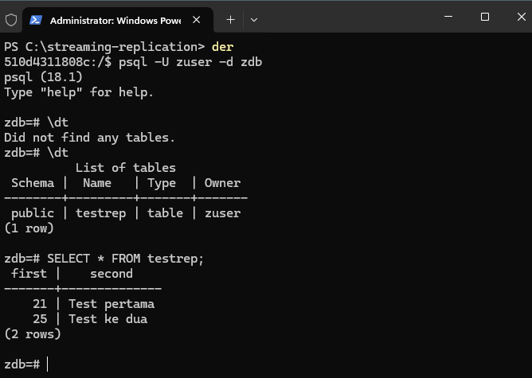  
</p>

### 4 High-Availability  
<p>
   Model replikasi ini dapat digunakan untuk kebutuhan High Availability (HA). Jika primary server mengalami gangguan atau down, salah satu replica dapat dijadikan pengganti. Berikut adalah langkah yang dapat dilakukan:<br>
</p>
<p>
   <b>Primary server mati</b><br>
   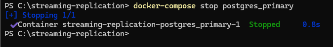
</p>
<p>
   Setelah diketahui bahwa primary server sedang down, kita dapat mempromosikan salah satu replica menjadi primary. Dengan promosi ini, replica yang sebelumnya hanya menyediakan akses read akan berubah menjadi server primary yang mendukung read-write. Berikut adalah perintah pg_promote() untuk melakukan promosi tersebut:<br>
   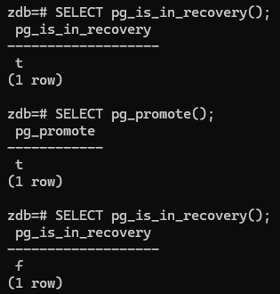
</p>
